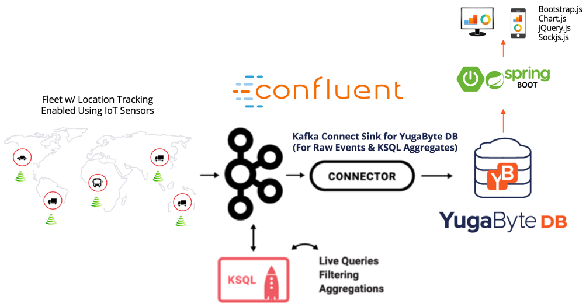
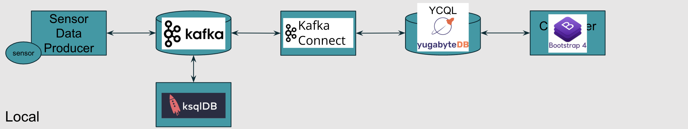
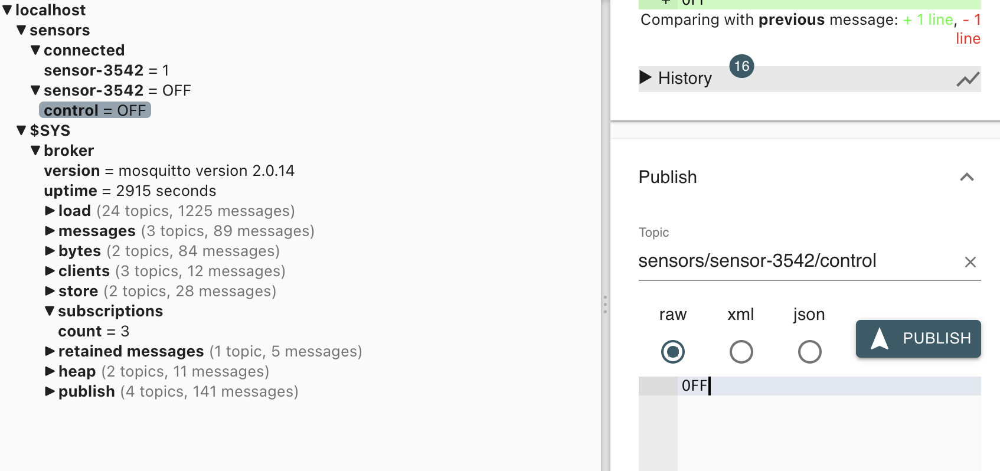
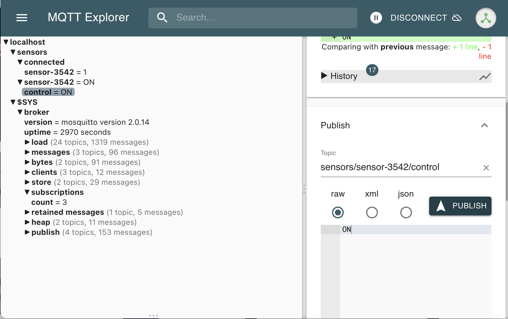

# Fun with Sensors' Data

- [Slide for this presentation](slides.pdf)
- Video Recording - TBA

## Versions

- Java 1.8 - This is important as a lot of component rely on it
- Confluent 5.0.x
- Yugabyte 2.13.x

## Sample App

### Architecture



### Architecture Block Environment



## Setup

1. Clone this repository into a directory. Lets refer is by `<project-dir>` in this article. In command below  its `fun-with-sensors-data`

    ```bash
    git clone https://github.com/yogendra/fun-with-sensors-data.git   fun-with-sensors-data
    cd fun-with-sensors-data
    ```

1. Setup Yugabyte

    1. [Install YugabyteDB](https://docs.yugabyte.com/quick-start/install/).  Any latest version can be chosen, `yugabyte-2.13.0.1` is just a sample

        **Mac**

        ```bash
        wget https://downloads.yugabyte.com/releases/2.13.0.1/yugabyte-2.13.0.1-b2-darwin-x86_64.tar.gz
        tar xvfz yugabyte-2.13.0.1-b2-darwin-x86_64.tar.gz
        ```

        OR

        **Linux x86_64**

        ```bash
        wget https://downloads.yugabyte.com/releases/2.13.0.1/yugabyte-2.13.0.1-b2-linux-x86_64.tar.gz
        tar xvfz yugabyte-2.13.0.1-b2-linux-x86_64.tar.gz
        ```

        OR

        **Linux ARM64**

        ```bash
        wget https://downloads.yugabyte.com/releases/2.13.0.1/yugabyte-2.13.0.1-b2-el8-aarch64.tar.gz
        tar xvfz yugabyte-2.13.0.1-b2-el8-aarch64.tar.gz
        ```

    1. Export varibles for quick access

        ```bash
        export YUGABYTE_HOME=$PWD/yugabyte-2.13.0.1
        export PATH="$YUGABYTE_HOME/bin:$PATH"

        ```
        
    3. [Create a local cluster](https://docs.yugabyte.com/latest/quick-start/create-local-cluster)

        ```bash
        yugabyte-2.13.0.1/bin/yugabyted start --listen 127.0.0.1
        ```

        **Output**

        ```log
        Starting yugabyted...
        ✅ System checks

        +--------------------------------------------------------------------------------------------------+
        |                                            yugabyted                                             |
        +--------------------------------------------------------------------------------------------------+
        | Status              : Running. Leader Master is present                                          |
        | Web console         : http://127.0.0.1:7000                                                      |
        | JDBC                : jdbc:postgresql://127.0.0.1:5433/yugabyte?user=yugabyte&password=yugabyte  |
        | YSQL                : bin/ysqlsh   -U yugabyte -d yugabyte                                       |
        | YCQL                : bin/ycqlsh   -u cassandra                                                  |
        | Data Dir            : <home-dir>/var/data                                                        |
        | Log Dir             : <home-dir>/var/logs                                                        |
        | Universe UUID       : <random-uuid>                                                              |
        +--------------------------------------------------------------------------------------------------+
        🚀 yugabyted started successfully! To load a sample dataset, try 'yugabyted demo'.
        🎉 Join us on Slack at https://www.yugabyte.com/slack
        👕 Claim your free t-shirt at https://www.yugabyte.com/community-rewards/
        ```

    1. (Optional) Check status

        ```bash
        yugabyte-2.13.0.1/bin/yugabyted status
        ```

        **Output**

        ```log
        +--------------------------------------------------------------------------------------------------+
        |                                            yugabyted                                             |
        +--------------------------------------------------------------------------------------------------+
        | Status              : Running. Leader Master is present                                          |
        | Web console         : http://127.0.0.1:7000                                                      |
        | JDBC                : jdbc:postgresql://127.0.0.1:5433/yugabyte?user=yugabyte&password=yugabyte  |
        | YSQL                : bin/ysqlsh   -U yugabyte -d yugabyte                                       |
        | YCQL                : bin/ycqlsh   -u cassandra                                                  |
        | Data Dir            : <home-dir>/var/data                                                        |
        | Log Dir             : <home-dir>/var/logs                                                        |
        | Universe UUID       : <random-uuid>                                                              |
        +--------------------------------------------------------------------------------------------------+

        ```

1. Setup Confluent Platform

    1. Download confluent platform and start local service

        ```bash
        wget "https://packages.confluent.io/archive/5.0/confluent-5.0.3-2.11.tar.gz"
        tar -xvf confluent-5.0.3-2.11.tar.gz
        export CONFLUENT_HOME=$PWD/confluent-5.0.3
        export PATH="$PATH:$CONFLUENT_HOME/bin"
        ```
    1. Install Yugabyte Sink Connector

        ```bash
        confluent-5.0.3/bin/confluent-hub install yugabyteinc/yb-kafka-connector:1.0.0 --no-prompt
        ```

        **Output**

        ```log
        Running in a "--no-prompt" mode
        Implicit confirmation of the question: You are about to install 'yb-kafka-connector' from Yugabyte, Inc., as published on Confluent Hub.
        Downloading component Kafka Connect Yugabyte 1.0.0, provided by Yugabyte, Inc. from Confluent Hub and installing into <project-dir>/confluent-5.0.3/share/confluent-hub-components
        Implicit confirmation of the question: Do you want to uninstall existing version 1.0.0?
        Adding installation directory to plugin path in the following files:
          <project-dir>/confluent-5.0.3/etc/kafka/connect-distributed.properties
          <project-dir>/confluent-5.0.3/etc/kafka/connect-standalone.properties
          <project-dir>/confluent-5.0.3/etc/schema-registry/connect-avro-distributed.properties
          <project-dir>/confluent-5.0.3/etc/schema-registry/connect-avro-standalone.properties
          /var/folders/b8/tmz5qjss0n32p_l31d81glnm0000gn/T/confluent.tgdxRufF/connect/connect.properties
          /var/folders/b8/tmz5qjss0n32p_l31d81glnm0000gn/T/confluent.tgdxRufF/connect/connect.properties

        Completed
        ```

    1. Start Confluent Platform

        
        ```bash
        confluent-5.0.3/bin/confluent start
        ```

        **Output**

        ```log
        This CLI is intended for development only, not for production
        https://docs.confluent.io/current/cli/index.html

        Using CONFLUENT_CURRENT: /var/folders/b8/tmz5qjss0n32p_l31d81glnm0000gn/T/confluent.nQSE6BnB
        Starting zookeeper
        zookeeper is [UP]
        Starting kafka
        kafka is [UP]
        Starting schema-registry
        schema-registry is [UP]
        Starting kafka-rest
        kafka-rest is [UP]
        Starting connect
        connect is [UP]
        Starting ksql-server
        ksql-server is [UP]
        Starting control-center
        control-center is [UP]
        ```


## Basic MQTT Demo

1. Start Mosquitto Server on local machine

1. Start simple-sensor.py in background

    ```bash
    scripts/simple-sensor.py &> /tmp/simple-sensor.py &
    ```

    **Output**

    ```log
    only sending changes
    starting
    Publishing on  sensors/sensor-3542
    send control to  sensors/sensor-3542/control
    Sensors States are  ['ON', 'OFF']
    connecting to broker localhost:1883
    Attempts  0
    publish on sensors/sensor-3542  message   OFF
    ```

1. Start mqtt display

    ```bash
    scripts/mqtt-display
    ```

    **Output**

    ```log
    OFF
    ```

1. Split open a new terminal, and turn on sensor

    ```bash
    scripts/mqtt-switch OFF
    ```

    **Output**
    (On the Display)

    ```bash
    OFF
    ON
    ```

1. Again, turn off sensor

    ```bash
    scripts/mqtt-switch OFF
    ```

    **Output**
    (On the Display)

    ```bash
    OFF
    ON
    OFF
    ```

1. Try same via MQTT Explores

    Send "ON" or "OFF" message on `sensors/sensor-3542/control` topic and see that state change for `sensors/sensor-3542`

    **On Sending OFF**
    

    **On Sending ON**
    

## IoT Fleet Management

FYI - Sample Payload

```json
{
  "vehicleId":"0bf45cac-d1b8-4364-a906-980e1c2bdbcb",
  "vehicleType":"Taxi",
  "routeId":"Route-37",
  "longitude":"-95.255615",
  "latitude":"33.49808",
  "timestamp":"2017-10-16 12:31:03",
  "speed":49.0,
  "fuelLevel":38.0
}
```

### Setup Fleet Management YB and Kafka

1. Clone IoT Fleet Management Project and make it

    ```bash
    git clone git@github.com:yogendra/yb-iot-fleet-management.git
    cd yb-iot-fleet-management
    mvn clean package -DskipTests
    cd ..
    ```

1. Create YCQL Tables

    ```bash
    yugabyte-2.13.0.1/bin/ycqlsh -f yb-iot-fleet-management/resources/IoTData.cql
    ```

    **Output**

    ```log

    count
    -------
        0

    (1 rows)

    count
    -------
        0

    (1 rows)

    count
    -------
        0

    (1 rows)

    count
    -------
        0

    (1 rows)
    ```

1. (Option) Check table definitions

    ```bash
    yugabyte-2.13.0.1/bin/ycqlsh -e "describe keyspace traffickeyspace;"
    ```

    **Output**

    ```sql

    CREATE KEYSPACE traffickeyspace WITH replication = {'class': 'SimpleStrategy', 'replication_factor': '1'}  AND durable_writes = true;

    CREATE TABLE traffickeyspace.origin_table (
        vehicleid text,
        timestamp timestamp,
        routeid text,
        vehicletype text,
        longitude text,
        latitude text,
        speed double,
        fuellevel double,
        PRIMARY KEY (vehicleid, timestamp)
    ) WITH CLUSTERING ORDER BY (timestamp ASC)
        AND default_time_to_live = 3600
        AND transactions = {'enabled': 'false'};

    CREATE TABLE traffickeyspace.window_traffic (
        routeid text,
        recorddate text,
        vehicletype text,
        totalcount bigint,
        timestamp timestamp,
        PRIMARY KEY (routeid, recorddate, vehicletype)
    ) WITH CLUSTERING ORDER BY (recorddate ASC, vehicletype ASC)
        AND default_time_to_live = 0
        AND transactions = {'enabled': 'false'};

    CREATE TABLE traffickeyspace.total_traffic (
        routeid text,
        recorddate text,
        vehicletype text,
        totalcount bigint,
        timestamp timestamp,
        PRIMARY KEY (routeid, recorddate, vehicletype)
    ) WITH CLUSTERING ORDER BY (recorddate ASC, vehicletype ASC)
        AND default_time_to_live = 0
        AND transactions = {'enabled': 'false'};

    CREATE TABLE traffickeyspace.poi_traffic (
        vehicleid text PRIMARY KEY,
        vehicletype text,
        distance bigint,
        timestamp timestamp
    ) WITH default_time_to_live = 0
        AND transactions = {'enabled': 'false'};
    ```

1. (Terminal - 2) Run dashboard application

    ```bash
    java -jar yb-iot-fleet-management/iot-springboot-dashboard/target/iot-springboot-dashboard-1.0.0.jar
    ```

1. [Click here to open dashboard - http://localhost:8080](http://localhost:8080/)

    Empty Dashboard would look like following:

    

1. Setup confluent components

    ```bash
    scripts/setup-kafka-objects-iot-fleet-mgmt
    ```

    **Output**

    ```log
    ##
    ## Create topic : iot-data-event
    ##

    Created topic "iot-data-event".

    ##
    ## Create KSQL Tables and Streams
    ##

    Mar 28, 2022 12:32:12 AM org.jline.utils.Log logr
    WARNING: Unable to create a system terminal, creating a dumb terminal (enable debug logging for more information)
    KSQL, Copyright 2017-2018 Confluent Inc.

    CLI v5.0.3, Server v5.0.3 located at http://localhost:8088

    Having trouble? Type 'help' (case-insensitive) for a rundown of how things work!

    ksql>   RUN SCRIPT '<project-dir>/yb-iot-fleet-management/iot-ksql-processor/setup_streams.ksql';
    Message
    ---------

    ---------
    ksql>   show tables;
    Table Name     | Kafka Topic    | Format | Windowed
    -----------------------------------------------------
    WINDOW_TRAFFIC | window_traffic | JSON   | true
    TOTAL_TRAFFIC  | total_traffic  | JSON   | false
    -----------------------------------------------------
    ksql>   show streams;
    Stream Name    | Kafka Topic    | Format
    ------------------------------------------
    TRAFFIC_STREAM | iot-data-event | JSON
    POI_TRAFFIC    | poi_traffic    | JSON
    ------------------------------------------
    ksql>   exitExiting KSQL.

    ##
    ## Create Kafka Connect Connector - yugabyte-sink
    ##

    {"name":"yugabyte-sink","config":{"confluent.license":"","key.converter":"org.apache.kafka.connect.storage.StringConverter","value.converter":"org.apache.kafka.connect.json.JsonConverter","key.converter.schemas.enable":"false","value.converter.schemas.enable":"false","offset.flush.interval.ms":"10000","connector.class":"com.yb.connect.sink.YBSinkConnector","yugabyte.cql.contact.points":"127.0.0.1:9042,127.0.0.2:9042,127.0.0.3:9042","yugabyte.cql.keyspace":"TrafficKeySpace","yugabyte.cql.tablename":"Origin_Table","topics":"iot-data-event","name":"yugabyte-sink"},"tasks":[],"type":"sink"}
    ##
    ## Create Kafka Connect Connector - yugabyte-sink-poi
    ##

    {"name":"yugabyte-sink-poi","config":{"confluent.license":"","key.converter":"org.apache.kafka.connect.storage.StringConverter","value.converter":"org.apache.kafka.connect.json.JsonConverter","key.converter.schemas.enable":"false","value.converter.schemas.enable":"false","offset.flush.interval.ms":"10000","connector.class":"com.yb.connect.sink.YBSinkConnector","yugabyte.cql.contact.points":"127.0.0.1:9042,127.0.0.2:9042,127.0.0.3:9042","yugabyte.cql.keyspace":"TrafficKeySpace","yugabyte.cql.tablename":"Poi_Traffic","topics":"poi_traffic","name":"yugabyte-sink-poi"},"tasks":[],"type":"sink"}
    ##
    ## Create Kafka Connect Connector - yugabyte-sink-total
    ##

    {"name":"yugabyte-sink-total","config":{"confluent.license":"","key.converter":"org.apache.kafka.connect.storage.StringConverter","value.converter":"org.apache.kafka.connect.json.JsonConverter","key.converter.schemas.enable":"false","value.converter.schemas.enable":"false","offset.flush.interval.ms":"10000","connector.class":"com.yb.connect.sink.YBSinkConnector","yugabyte.cql.contact.points":"127.0.0.1:9042,127.0.0.2:9042,127.0.0.3:9042","yugabyte.cql.keyspace":"TrafficKeySpace","yugabyte.cql.tablename":"Total_Traffic","topics":"total_traffic","name":"yugabyte-sink-total"},"tasks":[],"type":"sink"}
    ##
    ## Create Kafka Connect Connector - yugabyte-sink-window
    ##

    {"name":"yugabyte-sink-window","config":{"confluent.license":"","key.converter":"org.apache.kafka.connect.storage.StringConverter","value.converter":"org.apache.kafka.connect.json.JsonConverter","key.converter.schemas.enable":"false","value.converter.schemas.enable":"false","offset.flush.interval.ms":"10000","connector.class":"com.yb.connect.sink.YBSinkConnector","yugabyte.cql.contact.points":"127.0.0.1:9042,127.0.0.2:9042,127.0.0.3:9042","yugabyte.cql.keyspace":"TrafficKeySpace","yugabyte.cql.tablename":"Window_Traffic","topics":"window_traffic","name":"yugabyte-sink-window"},"tasks":[],"type":"sink"}
    ##
    ## Check connectors
    ##

    ["yugabyte-sink-total","yugabyte-sink","yugabyte-sink-window","yugabyte-sink-poi"]
    ##
    ## Completed
    ##
    ```

1. Run the sample data producer

    ```bash
    java -jar yb-iot-fleet-management/iot-kafka-producer/target/iot-kafka-producer-1.0.0.jar
    ```

    **Output**

    ```log
    2022-03-28 00:36:19 INFO  IoTDataProducer:46 - Using Zookeeper=localhost:2181 ,Broker-list=localhost:9092 and topic iot-data-event
    2022-03-28 00:36:20 INFO  VerifiableProperties:68 - Verifying properties
    2022-03-28 00:36:20 INFO  VerifiableProperties:68 - Property metadata.broker.list is overridden to localhost:9092
    2022-03-28 00:36:20 INFO  VerifiableProperties:68 - Property request.required.acks is overridden to 1
    2022-03-28 00:36:20 INFO  VerifiableProperties:68 - Property serializer.class is overridden to com.iot.app.kafka.util.IoTDataEncoder
    2022-03-28 00:36:20 WARN  VerifiableProperties:83 - Property zookeeper.connect is not valid
    SLF4J: Failed to load class "org.slf4j.impl.StaticLoggerBinder".
    SLF4J: Defaulting to no-operation (NOP) logger implementation
    SLF4J: See http://www.slf4j.org/codes.html#StaticLoggerBinder for further details.
    2022-03-28 00:36:20 INFO  IoTDataProducer:74 - Sending events
    2022-03-28 00:36:20 INFO  IoTDataEncoder:28 - {"vehicleId":"9ff178dc-37b5-446a-b045-476baaae4ad8","vehicleType":"18 Wheeler","routeId":"Route-37","longitude":"-95.536865","latitude":"33.04445","timestamp":"2022-03-27 09:36:20","speed":54.0,"fuelLevel":22.0}
    2022-03-28 00:36:20 INFO  ClientUtils$:68 - Fetching metadata from broker id:0,host:localhost,port:9092 with correlation id 0 for 1 topic(s) Set(iot-data-event)
    2022-03-28 00:36:20 INFO  SyncProducer:68 - Connected to localhost:9092 for producing
    2022-03-28 00:36:20 INFO  SyncProducer:68 - Disconnecting from localhost:9092
    2022-03-28 00:36:20 INFO  SyncProducer:68 - Connected to 10.20.30.229:9092 for producing
    2022-03-28 00:36:21 INFO  IoTDataEncoder:28 - {"vehicleId":"d4e47569-0e07-43b4-84e9-b7211dee3aa4","vehicleType":"18 Wheeler","routeId":"Route-37","longitude":"-95.74075","latitude":"33.217064","timestamp":"2022-03-27 09:36:21","speed":37.0,"fuelLevel":22.0}
    2022-03-28 00:36:21 INFO  IoTDataEncoder:28 - {"vehicleId":"ac55ed14-caed-4019-92ed-19d20934c045","vehicleType":"18 Wheeler","routeId":"Route-82","longitude":"-96.538895","latitude":"34.96734","timestamp":"2022-03-27 09:36:21","speed":35.0,"fuelLevel":17.0}
    ...
    ```

    Random data generated used following key points for co-ordinates.

    

1. [Goto dashboard](http://localhost:8080) to confirm data flowing into the system.

    
1. (Option) Check table record count

    ```bash
    ycqlsh -e "SELECT count(*) FROM TrafficKeySpace.Origin_Table; SELECT count(*) FROM TrafficKeySpace.Total_Traffic; SELECT count(*) FROM TrafficKeySpace.Window_Traffic; SELECT count(*) FROM TrafficKeySpace.Poi_Traffic; "
    ```

    **Output**

    ```log
    count
    -------
      346

    (1 rows)

    count
    -------
        15

    (1 rows)

    count
    -------
        15

    (1 rows)

    count
    -------
        4

    (1 rows)
    ```

## Clean up

- Partial  - Kafka cleanup

    ```bash
    scripts/cleanup-kafka-objects-iot-fleet-mgmt
    ```

- Partial - Yugabyte DB cleanup

    ```bash
    yugabyte-2.13.0.1/bin/ycqlsh -f yb-iot-fleet-management/resources/IoTData.cql
    ```

    **Output**

    ```log

    count
    -------
        0

    (1 rows)

    count
    -------
        0

    (1 rows)

    count
    -------
        0

    (1 rows)

    count
    -------
        0

    (1 rows)
    ```

- Full Cleanup

    ```bash
    scripts/cleanup
    ```

    **Output**

    ```log
    ##
    ## Destroy yugabyte cluster
    ##

    Stopped yugabyted using config <home-dir>/var/conf/yugabyted.conf.
    Deleted logs at <home-dir>/var/logs.
    Deleted data at <home-dir>/var/data.
    Deleted conf file at <home-dir>/var/conf/yugabyted.conf.

    ##
    ## Destroy confluent cluster
    ##

    This CLI is intended for development only, not for production
    https://docs.confluent.io/current/cli/index.html

    Using CONFLUENT_CURRENT: /var/folders/b8/tmz5qjss0n32p_l31d81glnm0000gn/T/confluent.XWr85AfY
    Stopping control-center
    control-center is [DOWN]
    Stopping ksql-server
    ksql-server is [DOWN]
    Stopping connect
    connect is [DOWN]
    Stopping kafka-rest
    kafka-rest is [DOWN]
    Stopping schema-registry
    schema-registry is [DOWN]
    Stopping kafka
    kafka is [DOWN]
    Stopping zookeeper
    zookeeper is [DOWN]
    Deleting: /var/folders/b8/tmz5qjss0n32p_l31d81glnm0000gn/T/confluent.XWr85AfY

    ##
    ## Kill iot-fleet-management applicaiton processes (producer and dashboard)
    ##

    ##
    ## Completed
    ##
    ```

## ToDo

1. Simple Sensor Data Example

1. Upgrade Java

1. Make into a single docker-compose
