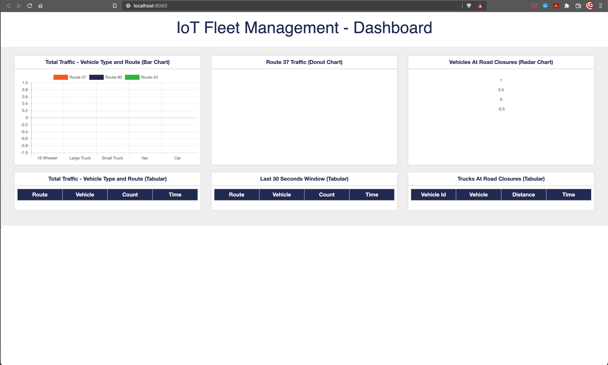
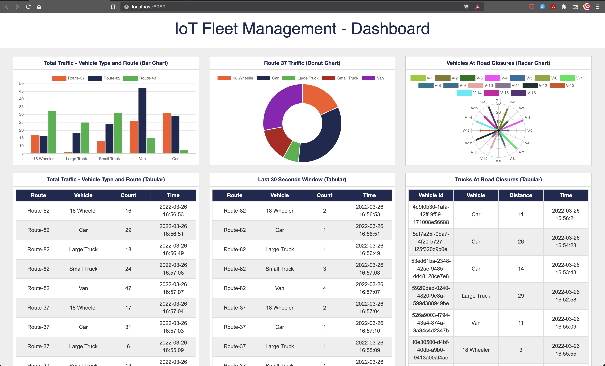

# Fun with Sensors' Data

## Versions

- Java 1.8 - This is important as a lot of component rely on it
- Confluent 5.0.x
- Yugabyte 2.13.x
- Mosquitto latest

## Setup
1. Clone this repository into a directory. Lets refer is by `<project-dir>` in this article. In command below  its `fun-with-sensors-data`

    ```bash
    git clone https://github.com/yogendra/fun-with-sensors-data.git   fun-with-sensors-data
    cd fun-with-sensors-data
    ```

1. Setup Yugabyte

    1. [Install YugabyteDB](https://docs.yugabyte.com/quick-start/install/).  Any latest version can be chosen, `yugabyte-2.13.0.1` is just a sample

        **Mac**

        ```bash
        wget https://downloads.yugabyte.com/releases/2.13.0.1/yugabyte-2.13.0.1-b2-darwin-x86_64.tar.gz
        tar xvfz yugabyte-2.13.0.1-b2-darwin-x86_64.tar.gz
        ```

        OR

        **Linux x86_64**

        ```bash
        wget https://downloads.yugabyte.com/releases/2.13.0.1/yugabyte-2.13.0.1-b2-linux-x86_64.tar.gz
        tar xvfz yugabyte-2.13.0.1-b2-linux-x86_64.tar.gz
        ```

        OR

        **Linux ARM64**

        ```bash
        wget https://downloads.yugabyte.com/releases/2.13.0.1/yugabyte-2.13.0.1-b2-el8-aarch64.tar.gz
        tar xvfz yugabyte-2.13.0.1-b2-el8-aarch64.tar.gz
        ```

    1. [Create a local cluster](https://docs.yugabyte.com/latest/quick-start/create-local-cluster)

        ```bash
        yugabyte-2.13.0.1/bin/yugabyted start --listen 127.0.0.1
        ```

        **Output**

        ```log
        Starting yugabyted...
        ✅ System checks

        +--------------------------------------------------------------------------------------------------+
        |                                            yugabyted                                             |
        +--------------------------------------------------------------------------------------------------+
        | Status              : Running. Leader Master is present                                          |
        | Web console         : http://127.0.0.1:7000                                                      |
        | JDBC                : jdbc:postgresql://127.0.0.1:5433/yugabyte?user=yugabyte&password=yugabyte  |
        | YSQL                : bin/ysqlsh   -U yugabyte -d yugabyte                                       |
        | YCQL                : bin/ycqlsh   -u cassandra                                                  |
        | Data Dir            : <home-dir>/var/data                                                        |
        | Log Dir             : <home-dir>/var/logs                                                        |
        | Universe UUID       : <random-uuid>                                                              |
        +--------------------------------------------------------------------------------------------------+
        🚀 yugabyted started successfully! To load a sample dataset, try 'yugabyted demo'.
        🎉 Join us on Slack at https://www.yugabyte.com/slack
        👕 Claim your free t-shirt at https://www.yugabyte.com/community-rewards/
        ```

    1. (Optional) Check status

        ```bash
        yugabyte-2.13.0.1/bin/yugabyted status
        ```

        **Output**

        ```log
        +--------------------------------------------------------------------------------------------------+
        |                                            yugabyted                                             |
        +--------------------------------------------------------------------------------------------------+
        | Status              : Running. Leader Master is present                                          |
        | Web console         : http://127.0.0.1:7000                                                      |
        | JDBC                : jdbc:postgresql://127.0.0.1:5433/yugabyte?user=yugabyte&password=yugabyte  |
        | YSQL                : bin/ysqlsh   -U yugabyte -d yugabyte                                       |
        | YCQL                : bin/ycqlsh   -u cassandra                                                  |
        | Data Dir            : <home-dir>/var/data                                                        |
        | Log Dir             : <home-dir>/var/logs                                                        |
        | Universe UUID       : <random-uuid>                                                              |
        +--------------------------------------------------------------------------------------------------+

        ```

1. Setup Confluent Platform

    1. Download confluent platform and start local service

        ```bash
        wget "https://packages.confluent.io/archive/5.0/confluent-5.0.3-2.11.tar.gz"
        tar -xvf confluent-5.0.3-2.11.tar.gz
        export CONFLUENT_HOME=$PWD/confluent-5.0.3
        export PATH=$PATH:$CONFLUENT_HOME/bin
        confluent-5.0.3/bin/confluent start
        ```

        **Output**

        ```log
        This CLI is intended for development only, not for production
        https://docs.confluent.io/current/cli/index.html

        Using CONFLUENT_CURRENT: /var/folders/b8/tmz5qjss0n32p_l31d81glnm0000gn/T/confluent.nQSE6BnB
        Starting zookeeper
        zookeeper is [UP]
        Starting kafka
        kafka is [UP]
        Starting schema-registry
        schema-registry is [UP]
        Starting kafka-rest
        kafka-rest is [UP]
        Starting connect
        connect is [UP]
        Starting ksql-server
        ksql-server is [UP]
        Starting control-center
        control-center is [UP]
        ```

    1. Install Yugabyte Sink Connector

        ```bash
        confluent-5.0.3/bin/confluent-hub install yugabyteinc/yb-kafka-connector:1.0.0 --no-prompt
        ```

        **Output**

        ```log
        Running in a "--no-prompt" mode
        Implicit confirmation of the question: You are about to install 'yb-kafka-connector' from Yugabyte, Inc., as published on Confluent Hub.
        Downloading component Kafka Connect Yugabyte 1.0.0, provided by Yugabyte, Inc. from Confluent Hub and installing into <project-dir>/confluent-5.0.3/share/confluent-hub-components
        Implicit confirmation of the question: Do you want to uninstall existing version 1.0.0?
        Adding installation directory to plugin path in the following files:
          <project-dir>/confluent-5.0.3/etc/kafka/connect-distributed.properties
          <project-dir>/confluent-5.0.3/etc/kafka/connect-standalone.properties
          <project-dir>/confluent-5.0.3/etc/schema-registry/connect-avro-distributed.properties
          <project-dir>/confluent-5.0.3/etc/schema-registry/connect-avro-standalone.properties
          /var/folders/b8/tmz5qjss0n32p_l31d81glnm0000gn/T/confluent.tgdxRufF/connect/connect.properties
          /var/folders/b8/tmz5qjss0n32p_l31d81glnm0000gn/T/confluent.tgdxRufF/connect/connect.properties

        Completed
        ```

## IoT Fleet Management

FYI - Sample Payload

```json
{
  "vehicleId":"0bf45cac-d1b8-4364-a906-980e1c2bdbcb",
  "vehicleType":"Taxi",
  "routeId":"Route-37",
  "longitude":"-95.255615",
  "latitude":"33.49808",
  "timestamp":"2017-10-16 12:31:03",
  "speed":49.0,
  "fuelLevel":38.0
}
```

### Setup Fleet Management YB and Kafka


1. Clone IoT Fleet Management Project and make it

    ```bash
    git clone git@github.com:yogendra/yb-iot-fleet-management.git
    cd yb-iot-fleet-management
    mvn clean package
    cd ..
    ```

1. Create YCQL Tables

    ```bash
    yugabyte-2.13.0.1/bin/ycqlsh -f yb-iot-fleet-management/resources/IoTData.cql
    ```

    **Output**

    ```log

    count
    -------
        0

    (1 rows)

    count
    -------
        0

    (1 rows)

    count
    -------
        0

    (1 rows)

    count
    -------
        0

    (1 rows)
    ```

1. (Option) Check table definitions

    ```bash
    yugabyte-2.13.0.1/bin/ycqlsh -e "describe keyspace traffickeyspace;"
    ```

    **Output**

    ```sql

    CREATE KEYSPACE traffickeyspace WITH replication = {'class': 'SimpleStrategy', 'replication_factor': '1'}  AND durable_writes = true;

    CREATE TABLE traffickeyspace.origin_table (
        vehicleid text,
        timestamp timestamp,
        routeid text,
        vehicletype text,
        longitude text,
        latitude text,
        speed double,
        fuellevel double,
        PRIMARY KEY (vehicleid, timestamp)
    ) WITH CLUSTERING ORDER BY (timestamp ASC)
        AND default_time_to_live = 3600
        AND transactions = {'enabled': 'false'};

    CREATE TABLE traffickeyspace.window_traffic (
        routeid text,
        recorddate text,
        vehicletype text,
        totalcount bigint,
        timestamp timestamp,
        PRIMARY KEY (routeid, recorddate, vehicletype)
    ) WITH CLUSTERING ORDER BY (recorddate ASC, vehicletype ASC)
        AND default_time_to_live = 0
        AND transactions = {'enabled': 'false'};

    CREATE TABLE traffickeyspace.total_traffic (
        routeid text,
        recorddate text,
        vehicletype text,
        totalcount bigint,
        timestamp timestamp,
        PRIMARY KEY (routeid, recorddate, vehicletype)
    ) WITH CLUSTERING ORDER BY (recorddate ASC, vehicletype ASC)
        AND default_time_to_live = 0
        AND transactions = {'enabled': 'false'};

    CREATE TABLE traffickeyspace.poi_traffic (
        vehicleid text PRIMARY KEY,
        vehicletype text,
        distance bigint,
        timestamp timestamp
    ) WITH default_time_to_live = 0
        AND transactions = {'enabled': 'false'};
    ```

1. Run dashboard application

    ```bash
    nohup java -jar yb-iot-fleet-management/iot-springboot-dashboard/target/iot-springboot-dashboard-1.0.0.jar &>> /tmp/iot-springboot-dashboard.log &
    ```

    Monitor  Dashboard Logs- `tail -f /tmp/iot-springboot-dashboard.log`

1. [Click here to open dashboard - http://localhost:8080](http://localhost:8080/)

    

1. Setup confluent components

    ```bash
    scripts/setup-confluent-iot-fleet-mgmt
    ```

    **Output**

    ```log
    ##
    ## Create KSQL Tables and Streams
    ##
    ##
    ## Create Kafka Connect Connector - yugabyte-sink
    ##
    ##
    ## Create Kafka Connect Connector - yugabyte-sink-poi
    ##
    ##
    ## Create Kafka Connect Connector - yugabyte-sink-total
    ##
    ##
    ## Create Kafka Connect Connector - yugabyte-sink-window
    ##
    Completed
      ```

1. Run the sample data producer

    ```bash
    nohup java -jar yb-iot-fleet-management/iot-kafka-producer/target/iot-kafka-producer-1.0.0.jar  &>> /tmp/iot-kafka-producer.log &
    ```

    Monitor  Producer Logs- `tail -f /tmp/iot-kafka-producer.log`
1. [Goto dashboard](http://localhost:8080) to confirm data flowing into the system.

    
1. (Option) Check table record count

    ```bash
    ycqlsh -e "SELECT count(*) FROM TrafficKeySpace.Origin_Table; SELECT count(*) FROM TrafficKeySpace.Total_Traffic; SELECT count(*) FROM TrafficKeySpace.Window_Traffic; SELECT count(*) FROM TrafficKeySpace.Poi_Traffic; "
    ```

    **Output**

    ```log

    count
    -------


    (1 rows)

    count
    -------
        0

    (1 rows)

    count
    -------
        0

    (1 rows)

    count
    -------
        0

    (1 rows)
    ```


## [WIP / DRAFT ] Demo : Sensor Data

### Setup Sensor Data Kafka, MQTT and Yugabyte

1. Create topic for mqtt temperatures

    ```bash
    kafka-topics --create  --zookeeper localhost:2181 --replication-factor 1 --partitions 1 --topic mqtt.temperature
    ```

    **Output**

    ```log
    WARNING: Due to limitations in metric names, topics with a period ('.') or underscore ('_') could collide. To avoid issues it is best to use either, but not both.
    Created topic mqtt.temperature.
    ```

1. Setup Kafka MQTT Connect

    1. Create connector for `mqtt-source`

        ```bash
        curl -s -X POST -H 'Content-Type: application/json' http://localhost:8083/connectors \
        -d '{
          "name" : "mqtt-source",
          "config" : {
            "connector.class" : "io.confluent.connect.mqtt.MqttSourceConnector",
            "tasks.max" : "1",
            "mqtt.server.uri" : "tcp://127.0.0.1:1883",
            "mqtt.topics" : "temperature",
            "value.converter": "org.apache.kafka.connect.json.JsonConverter",
            "key.converter": "org.apache.kafka.connect.storage.StringConverter",
            "kafka.topic" : "mqtt.temperature",
            "confluent.topic.bootstrap.servers": "localhost:9092",
            "confluent.topic.replication.factor": "1",
            "confluent.license":""
          }
        }'
        ```

        **Output**

        ```json
        {"name":"mqtt-source","config":{"connector.class":"io.confluent.connect.mqtt.MqttSourceConnector","tasks.max":"1","mqtt.server.uri":"tcp://127.0.0.1:1883","mqtt.topics":"temperature","kafka.topic":"mqtt.temperature","confluent.topic.bootstrap.servers":"localhost:9092","confluent.topic.replication.factor":"1","confluent.license":"","name":"mqtt-source"},"tasks":[],"type":"source"}
        ```

    1. (Optional) List connector status

        ```bash
        curl http://localhost:8083/connectors
        ```

        **Output**

        ```json
        ["mqtt-source"]
        ```

        OR using `confluent`

        ```bash
        confluent local services connect connector status
        ```

        **Output**

        ```log
        The local commands are intended for a single-node development environment only,
        NOT for production usage. https://docs.confluent.io/current/cli/index.html

        [
          "mqtt-source"
        ]
        ```

    1. (Optional) Check `mqtt-source` status

        ```bash
        curl -s "http://localhost:8083/connectors/mqtt-source/status"
        ```

        **Output**

        ```json
        {"name":"mqtt-source","connector":{"state":"RUNNING","worker_id":"10.20.30.229:8083"},"tasks":[{"id":0,"state":"RUNNING","worker_id":"10.20.30.229:8083"}],"type":"source"}
        ```

        OR using `confluent`

        ```bash
        confluent local services connect connector status mqtt-source
        ```

        **Output**

        ```log
        The local commands are intended for a single-node development environment only,
        NOT for production usage. https://docs.confluent.io/current/cli/index.html

        {
          "name": "mqtt-source",
          "connector": {
            "state": "RUNNING",
            "worker_id": "<your-machine-ip>:8083"
          },
          "tasks": [
            {
              "id": 0,
              "state": "RUNNING",
              "worker_id": "<your-machine-ip>:8083"
            }
          ],
          "type": "source"
        }
        ```

    1. FYI Only - Delete connector

        ```bash
        curl -s -X DELETE localhost:8083/connectors/mqtt-source
        ```

        **Output**

        _No Output_

1. (Optional) Test MQTT and Kafka Setup

    1. Terminal 2: Run `mosquitto_sub` to listen on temperature

        ```bash
        mosquitto_sub -h 127.0.0.1 -t temperature
        ```

        **Output**

        _No Output_

    1. Terminal 3: Run `kafka-console-consumer` to listen to `mqtt.temperature` topic

        ```bash
        kafka-console-consumer  --zookeeper localhost:2181 --topic mqtt.temperature --property print.key=true --from-beginning
        ```

        **Output**

        _No Output_

    1. Launch ycqlsh. You can find `ycqlsh` in the `bin` subdirectory located inside the YugabyteDB installation folder.

        ```bash
        yugabyte-2.13.0.1/bin/ycqlsh
        ```

        **Output**

        ```log
        [ycqlsh 5.0.1 | Cassandra 3.9-SNAPSHOT | CQL spec 3.4.2 | Native protocol v4]
        Use HELP for help.
        ycqlsh>
        ```

    1. Create a keyspace and table by running the following command.

        Run following in the `cqlsh`

        ```sql
        CREATE KEYSPACE IF NOT EXISTS demo;
        CREATE TABLE demo.test_table (key text, value bigint, ts timestamp, PRIMARY KEY (key));
        ```

        **Output**

        _No Output_

1. Setup Kafka Yugabyte Connector

    1. Create kafka connect

        ```bash
        curl -s -X POST -H 'Content-Type: application/json' http://localhost:8083/connectors \
        -d '{
          "name" : "yugbayte-sink",
          "config" : {
            "connector.class" : "com.yb.connect.sink.YBSinkConnector",
            "topics": "mqtt.temperature",
            "tasks.max" : "1",
            "key.converter": "org.apache.kafka.connect.storage.StringConverter",
            "value.converter": "org.apache.kafka.connect.storage.StringConverter"
            "key.converter.schemas.enable": "false",
            "value.converter.schemas.enable":"false",
            "yugabyte.cql.keyspace": "demo",
            "yugabyte.cql.tablename": "test_table",
            "yugabyte.cql.contact.points": "127.0.0.1:9042,127.0.0.2:9042,127.0.0.3:9042",
            "confluent.license":""
          }
        }'
        ```

        **Output**

        ```json
        {"name":"yugbayte-sink","config":{"connector.class":"com.yb.connect.sink.YBSinkConnector","topics":"mqtt.temperature","tasks.max":"1","yugabyte.cql.keyspace":"demo","yugabyte.cql.tablename":"test_table","yugabyte.cql.contact.points":"127.0.0.1:9042,127.0.0.2:9042,127.0.0.3:9042","confluent.topic.bootstrap.servers":"localhost:9092","confluent.topic.replication.factor":"1","confluent.license":"","name":"yugbayte-sink"},"tasks":[],"type":"sink"}
        ```

## Clean up

```bash
scripts/cleanup
```

## ToDo

1. Simple Sensor Data Example

1. Upgrade Java

1. Make into a single docker-compose
